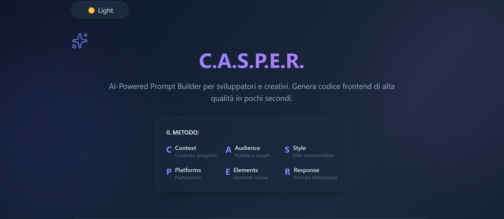

# 🧠 C.A.S.P.E.R. Prompt Generator

Un'applicazione web sviluppata con **Next.js** e **TypeScript** che permette agli utenti di generare prompt per AI seguendo il metodo **C.A.S.P.E.R.**. Il progetto utilizza l’API **Google Gemini (Generative AI)** per creare prompt personalizzati basati sulle sezioni inserite dall’utente.

---

## 🔹 Caratteristiche

- Interfaccia moderna con **dark mode** toggle.
- 5 campi di input separati per ogni sezione di C.A.S.P.E.R.:
  - **Context**: descrizione del contesto
  - **Audience**: pubblico di destinazione
  - **Style**: stile comunicativo
  - **Platforms**: piattaforme di utilizzo
  - **Elements**: componenti chiave
- Invio dei dati all’API interna `/api/generatePrompt`.
- Risultato generato dall’AI visualizzato direttamente nell’interfaccia.
- Gestione degli errori e stato di **loading** durante la generazione del prompt.
- Integrazione con **Lucide React Icons** per un’interfaccia moderna e intuitiva.

---

## 🔹 Tecnologie utilizzate

- [Next.js](https://nextjs.org/) (React + SSR)
- [TypeScript](https://www.typescriptlang.org/)
- [Tailwind CSS](https://tailwindcss.com/) per lo stile
- [Google Gemini API](https://developers.generativeai.google/) per generare i prompt
- [Lucide React](https://lucide.dev/) per le icone SVG

## Demo -> https://casper-prompt-generator.vercel.app/

## Docker

Build locale:

docker-compose build
docker-compose up -d Oppure usando l'immagine su Docker Hub:

docker pull sirdavi/casper-prompt-generator:latest
docker-compose up